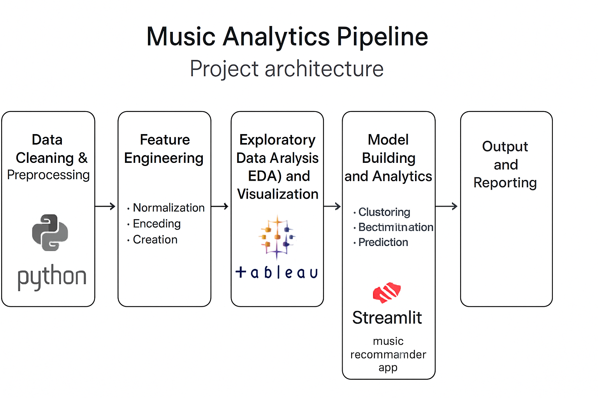
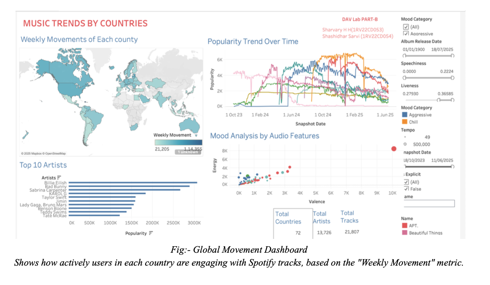
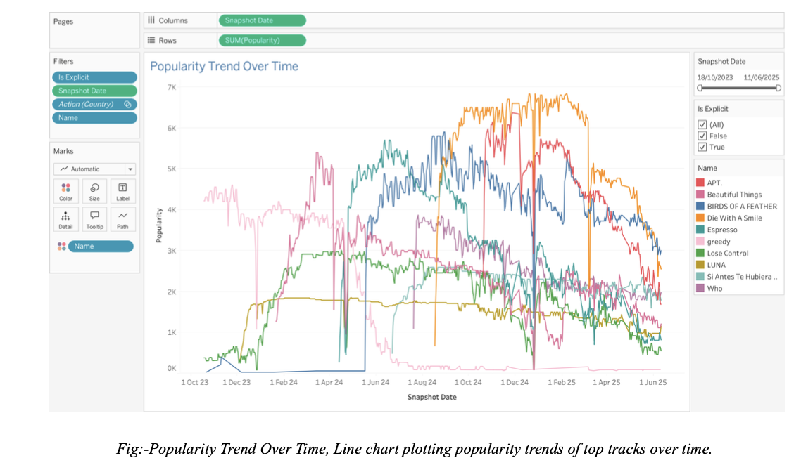
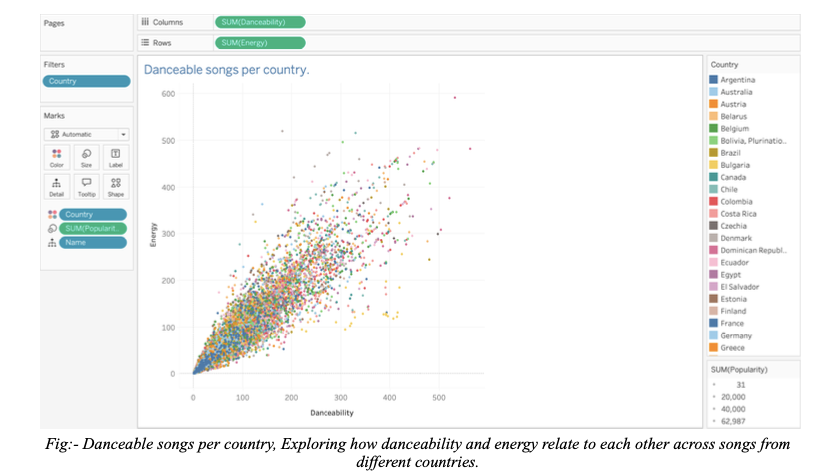
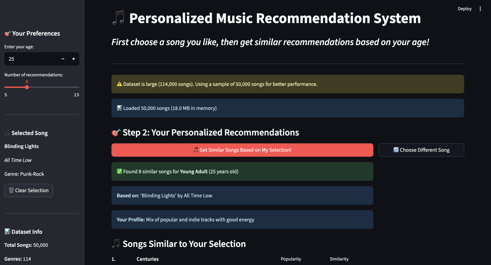

# MusicTrendAnalysisByCountry
A data visualization project which includes the complete pipeline from data collection, cleaning, featuring, EDA, and applying an ML technique to find the solution.



Data Preprocessing Steps

## Data Collection
Collected data from [state your data source, e.g. Kaggle, UCI, scraped websites, survey, etc.] ensuring relevance and comprehensiveness for the project goal.

Imported datasets to the working environment for further exploration.

## Data Exploration
Explored the raw data: inspected shapes, types, unique values, descriptive statistics, and column names.

Detected obvious errors, inconsistencies, or unusual patterns through summary statistics and visualization.

## Data Cleaning
Handled missing values: identified null or blank entries and treated them by removing, imputing (mean/median/mode), or flagging as needed.

Removed duplicate rows to ensure each data point is unique.

Detected and addressed outliers or impossible values using statistical thresholds or domain logic (e.g., replacing '0' in age column with NaN).

Standardized formats (e.g., date/time) and ensured units and labels are uniform across the dataset.

## Data Transformation
Encoded categorical features: converted non-numerical values into numeric representations using label encoding or one-hot encoding, making the dataset suitable for machine learning models.

Created or modified features as required by feature engineering tasks.

## Feature Scaling
Normalized or standardized numeric features to ensure comparability and improve model performance, typically using methods such as MinMaxScaler or StandardScaler.

## Data Splitting
Splitted the dataset into training, validation, and test sets to assess model performance and prevent overfitting.

## Documentation & Reproducibility
Documented each step with clear code comments and maintained a changelog of modifications during preprocessing for transparency and reproducibility.


## Data Visualization (Tableau)

Imported cleaned dataset.
Built dashboards to explore countrywide music trends and age-group preferences.
Generated insights like:
Most popular genres per country.
Trending songs across different age brackets.
Artist-level popularity comparisons.




# 🎵 Music Recommendation System - Setup Instructions

## Prerequisites

- Python 3.7 or higher installed on your system
- Your dataset file named `cleaned_genres_data.csv`

## Step 1: Download Files

Save these files in the same directory:
1. `app.py` (the main application code)
2. `requirements.txt` (dependencies list)  
3. `cleaned_genres_data.csv` (your dataset)

## Step 2: Install Dependencies

Open terminal/command prompt in the project directory and run:

```bash
pip install -r requirements.txt
```

**Alternative** (if you don't want to use requirements.txt):
```bash
pip install streamlit pandas numpy
```

## Step 3: Verify Dataset

Make sure your `cleaned_genres_data.csv` file contains these columns:
- `track_id`
- `artists`  
- `album_name`
- `track_name`
- `popularity`
- `duration_ms`
- `explicit`
- `danceability`
- `energy`
- `loudness`
- `speechiness`
- `acousticness`
- `instrumentalness`
- `liveness`
- `valence`
- `tempo`
- `track_genre`

## Step 4: Run the Application

In your terminal/command prompt, navigate to the project directory and run:

```bash
streamlit run app.py
```

## Step 5: Access the Web Interface

- The application will automatically open in your default web browser
- If it doesn't open automatically, go to: `http://localhost:8501`
- The terminal will show you the exact URL

## How to Use

1. **Enter your age** in the sidebar (10-100 years)
2. **Choose number of recommendations** (5-20 songs)
3. **Click "Get My Recommendations"** to get personalized song suggestions
4. **Use the search feature** to find specific songs or artists
5. **Expand song details** to see more information about each track

## Age Group Logic

- **Teenagers (13-19):** High energy pop, hip-hop, EDM
- **Young Adults (20-29):** Mix of popular and indie tracks  
- **Adults (30-49):** Rock, jazz, acoustic, more mature sounds
- **Seniors (50+):** Classical, jazz, acoustic, timeless classics

## Step 1: Song Selection

Search functionality - Type song name or artist to find songs
Popular songs section - Browse top popular songs if you're unsure
Select button - Choose the song you want to listen to now

## Step 2: Similar Recommendations

Based on your selected song - Uses audio features similarity
Filtered by your age group - Applies age-based preferences
Combined scoring - 70% similarity + 30% popularity for best results

## 🧠 Now Uses AIML Algorithm:
Cosine Similarity from scikit-learn:

Analyzes audio features: danceability, energy, loudness, speechiness, acousticness, etc.
Creates similarity matrix between all songs
Finds songs most similar to your selected track

## 🎵 How It Works:

Search & Select - Find and choose a song you like
Age Input - Enter your age for personalized filtering
Get Recommendations - System finds similar songs based on:

Audio feature similarity to your selected song
Age group preferences for better matching
Popularity score for quality assurance
## Troubleshooting



**Error: "Dataset file not found"**
- Make sure `cleaned_genres_data.csv` is in the same folder as `app.py`
- Check the file name spelling exactly

**Error: "Module not found"**  
- Run `pip install streamlit pandas numpy` again
- Make sure you're using the correct Python environment

**Port already in use**
- Use: `streamlit run app.py --server.port 8502`
- Or close other Streamlit applications

**Application not loading**
- Check terminal for error messages
- Ensure Python version is 3.7+
- Try refreshing the browser page

## Features

✅ **Age-based recommendations** using music characteristics  
✅ **Interactive web interface** with Streamlit  
✅ **Song search functionality**  
✅ **Detailed song information** (duration, popularity, audio features)  
✅ **Responsive design** with sidebar controls  
✅ **Real-time filtering** based on danceability, energy, and valence  

## Stopping the Application

Press `Ctrl + C` in the terminal to stop the Streamlit server.

---

🎵 **Enjoy discovering new music based on your age preferences!**
